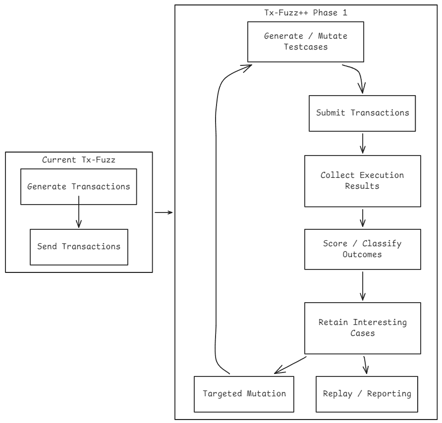

# Tx-Fuzz++: Automated Feedback-Driven and AI-Guided Transaction Fuzzing Framework

## I. Executive Summary

This proposal describes a project-focused upgrade path for the existing [Tx-Fuzz](https://github.com/MariusVanDerWijden/tx-fuzz) repository. The goal is to evolve Tx-Fuzz from a random Ethereum transaction generator into a closed-loop transaction fuzzing framework that can collect execution feedback, retain high-value cases, guide mutations, and produce replayable reports for Ethereum client testing.

Ethereum transaction handling is a security-critical input surface. Transactions pass through validation, mempool handling, execution, networking, storage, and fork-specific rule paths. As transaction formats expand across legacy transactions, EIP-1559, blob transactions, authorization-related transaction types, and future fork rules, testing requires more than high-volume random generation. The upgraded framework should prioritize reproducibility, signal extraction, and actionable debugging output.

The proposed upgrade has two complementary layers:

- **Automation Layer:** Adds structured feedback collection, interestingness scoring, corpus retention, targeted mutation, replay, deduplication, and reporting.
- **Specification-Guided Layer:** Uses LLM-assisted analysis of EIPs and protocol specifications to identify transaction constraints, boundary cases, and generation hints.

The intended outcome is a more useful Tx-Fuzz workflow for client regression testing, fork-readiness validation, differential testing, and security research.

## II. Project Context

Tx-Fuzz currently provides reusable functions and command-line tools for generating and submitting randomized Ethereum transactions. It already includes fork-oriented command packages, transaction generation logic, mutators, and spammer utilities. These components are a strong base for an upgraded fuzzing workflow because they already operate close to the transaction input boundary.

The current limitation is that random transaction generation stops short of a full testing loop. A modern transaction fuzzer should identify which inputs produced meaningful behavior, keep the valuable cases, reduce duplicate findings, and make interesting results easy to replay. Without feedback and retention, high-volume fuzzing can produce noisy output that is difficult to triage.

Tx-Fuzz++ should therefore preserve the repository's existing strengths while adding a feedback-driven layer around generation, submission, observation, and replay.

## III. Upgrade Objectives

The upgraded framework should:

1. Capture structured input and output signals for every generated testcase.
2. Identify interesting results such as crashes, unusual rejections, anomalous runtime behavior, and unexpected execution outcomes.
3. Retain a minimized corpus of high-value transactions for replay and regression testing.
4. Guide future mutations toward transaction fields and boundary conditions that produce useful signals.
5. Generate reproducible artifacts, including transaction payloads, metadata, logs, and replay commands.
6. Support specification-derived transaction templates for newer EIPs and fork-dependent rules.

## IV. Proposed Design

### Phase 1: Automation Upgrade

Phase 1 builds the core closed-loop fuzzing infrastructure.

#### 1. Structured Feedback Collection

Add a runner and collector layer that records the full lifecycle of each testcase, including:

- transaction metadata and encoded payloads
- mutation provenance and seed information
- RPC submission results and error responses
- inclusion or execution outcomes when available
- client health signals such as stderr, panic, crash, and exit behavior
- runtime indicators such as gas usage, execution time, and response latency

This layer creates the data foundation for selection, deduplication, replay, and reporting.

#### 2. Interestingness Scoring and Corpus Retention

Define scoring rules for outcomes that deserve retention. Examples include:

- new crash signatures
- new rejection or validation-error patterns
- anomalous gas usage or runtime behavior
- unexpected execution-result buckets
- divergent behavior across clients or fork configurations

The corpus manager should retain high-value cases while filtering duplicate or low-signal noise.

#### 3. Feedback-Guided Targeted Mutation

Use collected feedback to prioritize transaction fields and mutation strategies. Candidate mutation targets include:

- nonce, gas limit, gas price, and fee fields
- calldata length, structure, and localized byte mutations
- access lists
- blob-related fields
- authorization-related fields for newer transaction types
- fork-dependent validity boundaries

This should be layered on top of the existing generator and mutator packages rather than replacing them.

#### 4. Replay, Deduplication, and Reporting

Reproducibility should be a first-class output. Phase 1 should provide:

- deduplicated crash or anomaly signatures
- replayable transaction artifacts
- replay scripts or command examples
- structured JSON reports for debugging and responsible disclosure workflows
- summaries that connect inputs, observed behavior, and client environment details

#### 5. Evaluation Campaign

Benchmark the upgraded workflow against baseline random fuzzing on selected Ethereum execution clients. Useful metrics include:

- **Penetration Depth:** ratio of transactions that reach deeper validation or execution paths
- **Execution Coverage Signals:** unique traces, touched state paths, or result buckets where available
- **Time-to-First-Crash:** speed of reproducing known historical issue classes
- **Triaging Overhead:** reduction in duplicate logs and manually reviewed noise
- **Replay Reliability:** percentage of retained cases that reproduce consistently

The campaign should produce a replayable corpus and structured findings suitable for upstream issue reports.

### Phase 2: Specification-Guided Upgrade

Phase 2 adds semantic guidance from protocol specifications.

This layer should analyze EIPs, execution-layer rules, and fork-specific transaction requirements to extract:

- transaction validity constraints
- required and optional fields
- field dependencies
- boundary values and invalid combinations
- fork activation assumptions
- scenario templates for new transaction types

The extracted guidance can be translated into transaction templates, mutation hints, and prioritization rules. The objective is not to replace fuzzing with LLM-generated cases, but to combine execution feedback with specification-derived constraints so that generated tests are more targeted and easier to interpret.

## V. Implementation Roadmap

### Milestone 1: Feedback-Driven Automation

- Design the testcase metadata schema.
- Implement the runner and feedback collector.
- Add crash, error, and anomaly signature extraction.
- Implement corpus retention and deduplication.
- Add replayable testcase export.
- Produce structured reports for retained findings.
- Validate the workflow against at least one local execution client.

### Milestone 2: Guided Mutation and Evaluation

- Add feedback-informed mutation policies.
- Prioritize high-value transaction fields and boundary conditions.
- Compare guided fuzzing against baseline random generation.
- Measure replay reliability, triage reduction, and interesting-case discovery.
- Publish an initial retained testcase corpus and evaluation summary.

### Milestone 3: Specification-Guided Templates

- Build an EIP/specification analysis workflow for transaction-related rules.
- Convert extracted constraints into testcase templates and mutation hints.
- Integrate templates with the feedback-driven generation loop.
- Evaluate the approach on selected recent transaction-related EIPs.

## VI. Expected Deliverables

- Upgraded Tx-Fuzz workflow with feedback collection and corpus retention.
- Replayable testcase artifacts and report format.
- Guided mutation policies for transaction fields and fork-specific boundaries.
- Specification-derived transaction templates for selected EIPs.
- Documentation covering setup, execution, replay, and result interpretation.
- Evaluation report comparing baseline random fuzzing and upgraded feedback-guided fuzzing.

## VII. Success Criteria

The upgrade is successful if Tx-Fuzz++ can:

1. Preserve and replay interesting transactions reliably.
2. Reduce duplicate or low-signal fuzzing output.
3. Produce structured reports that accelerate client debugging.
4. Discover deeper validation, execution, or error paths than baseline random generation.
5. Support extensible templates for future transaction formats and fork rules.
